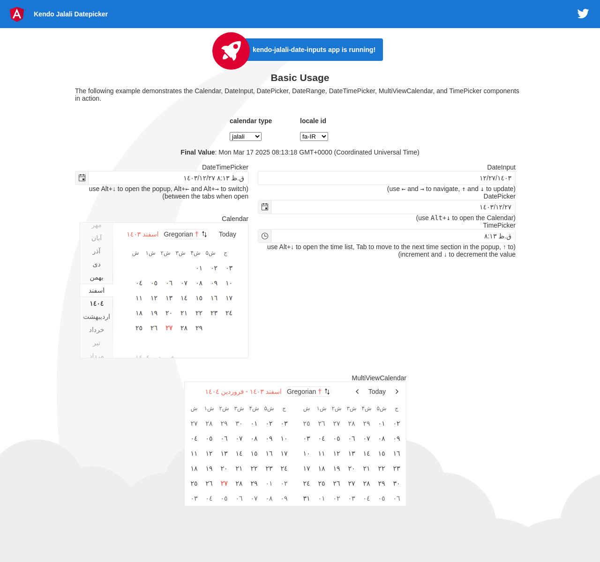

# kendo-jalali-date-inputs
This is a configurable jalali (persian, khorshidi, shamsi, jalali) date-picker for Angular 2 applications based on [kendo-dateinputs](https://www.telerik.com/kendo-angular-ui/components/dateinputs/).


[](https://travis-ci.org/tiampersian/kendo-jalali-date-inputs) 
[](https://badge.fury.io/js/kendo-jalali-date-inputs)
[](http://packagequality.com/#?package=kendo-jalali-date-inputs)
[](https://david-dm.org/tiampersian/kendo-jalali-date-inputs)
[](https://david-dm.org/tiampersian/kendo-jalali-date-inputs?type=dev)

[kendo-jalali-date-inputs DEMO](https://tiampersian.github.io/kendo-jalali-date-inputs/)
## Screenshots



## Installation:
1. Download from npm:
`npm install @tiampersian/kendo-jalali-date-inputs --save` 
2. import the `KendoJalaliDateInputsModule` module in typescript (.ts) or es6 files like below:  
 `import { KendoJalaliDateInputsModule } from '@tiampersian/kendo-jalali-date-inputs';`  

 3. Add `KendoJalaliDateInputsModule` to your module imports:  
```ts
 @NgModule({
   ...
   imports: [
     ...
     KendoJalaliDateInputsModule
   ]
 })
```
